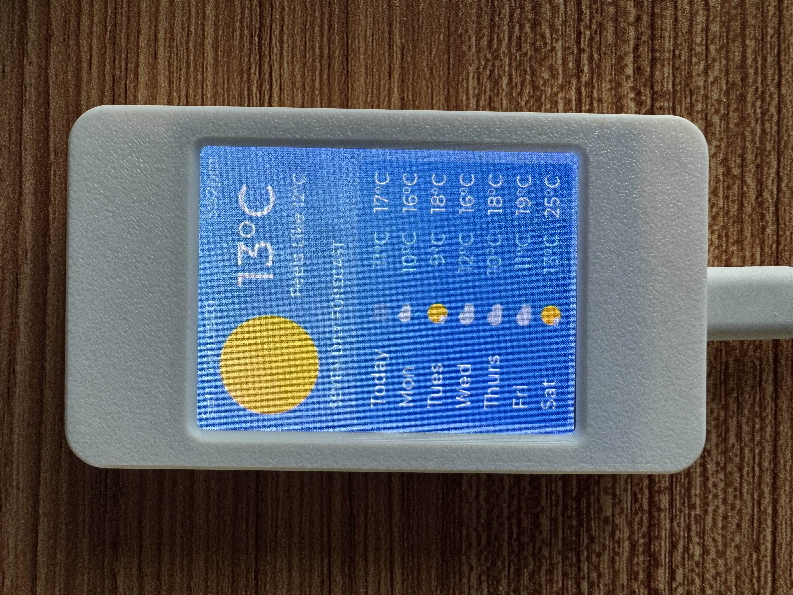
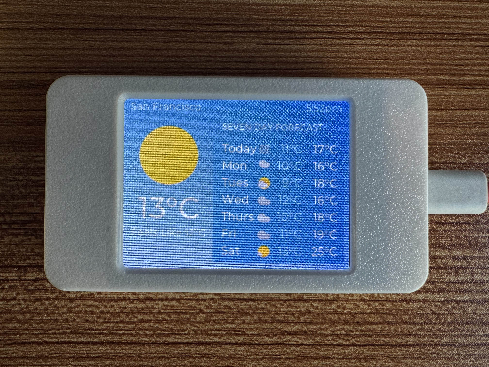

# Aura

Fork of the main project ported on PlatformIO and including a dropdown box to be able to display the screen in Landscape mode.

Aura is a simple weather widget that runs on ESP32-2432S028R ILI9341 devices with a 2.8" screen. These devices are sometimes called a "CYD" or Cheap Yellow Display.

> **Note:** This project is a fork of [Surrey-Homeware/Aura](https://github.com/Surrey-Homeware/Aura/tree/main/aura).

### Project Screenshots

### License

You can use the source code here under the terms of the GPL 3.0 license.

The icons are not included in that license. See "Thanks" below for details on the icons.

### How to compile (PlatformIO):

1.  Open the project folder in **VS Code**.
2.  Install the **PlatformIO IDE** extension.
3.  PlatformIO will automatically handle library dependencies based on `platformio.ini`.
4.  Build and upload the project using the PlatformIO toolbar at the bottom of VS Code.

### Configuration & Features

* **Orientation:** This version is specifically optimized for **landscape mode** to provide a better viewing experience for weather data.
* **Rotation:** You can change the screen orientation directly from the settings menu on the device.
* **Wi-Fi:** The device will create a temporary access point named "Aura" on the first boot to configure Wi-Fi credentials.
* **Location:** City locations can be searched and changed via the Aura Settings menu.

### Libraries required to compile:

* ArduinoJson
* HttpClient
* TFT_eSPI
* WifiManager
* XPT2046_Touchscreen
* lvgl

### Thanks & Credits

* Weather icons from https://github.com/mrdarrengriffin/google-weather-icons/tree/main/v2
* Thanks to [lvgl](https://lvgl.io/), a great library for UIs on ESP32 devices that made this much easier
* Thanks to [witnessmenow](https://github.com/witnessmenow/)'s [CYD Github repo](https://github.com/witnessmenow/ESP32-Cheap-Yellow-Display) for dev board reference information
* Thanks to [Random Nerd Tutorials](https://randomnerdtutorials.com/) for helpful ESP32 / CYD information
* Thanks to these sweet libraries that made this possible:
    * [ArduinoJson](https://arduinojson.org/)
    * [HttpClient](https://github.com/amcewen/HttpClient)
    * [TFT_eSPI](https://github.com/Bodmer/TFT_eSPI)
    * [WifiManager](https://github.com/tzapu/WiFiManager)
    * [XPT2046_Touchscreen](https://github.com/PaulStoffregen/XPT2046_Touchscreen)
    * [lvgl](https://lvgl.io/)
